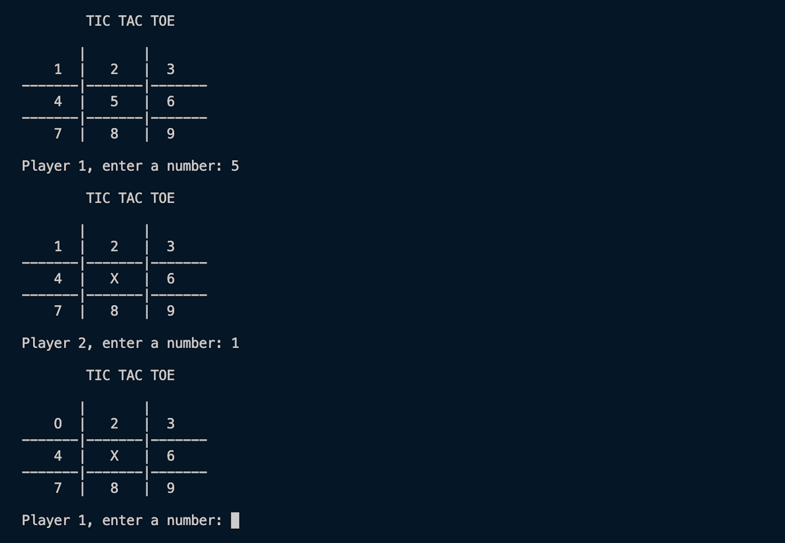

# 🧩 Tic-Tac-Toe

Made to chill and strength my understanding of fundamental programming logic, control structures, and algorithmic thinking in C, here's a classic Tic-Tac-Toe game that runs entirely in the console. It allows two players to compete interactively, validating moves, detecting wins or draws, and displaying the board dynamically after each turn.

---

## 📝 Project Overview

It work as an interactive console-based game that simulates the traditional Tic-Tac-Toe experience for two players. It utilizes a 3x3 grid represented by a two-dimensional array, where players alternate turns entering their chosen positions. Each move is validated to prevent overwriting existing marks, and the program continuously checks for winning combinations or draw conditions after every turn. The board updates dynamically, providing real-time feedback through a clean, text-based interface. Designed with procedural logic and modular functions, the project demonstrates core principles of C programming—such as loops, conditionals, arrays, and user input handling—while maintaining a simple and efficient structure that can be easily extended for single-player or AI-based gameplay in future iterations.

---

## 🖼️ Preview



---

## 🖥️ Project Structure
```
TICTACTOE/
│── tictactoe.c #All code used
│── tictactoe #Binary file
│── Screenshot.png #Project view
│── README.md # Project documentation
│── LICENSE # Project documentation
│── .gitignore # Project documentation
```
---

## 🛠️ Built With

- **Game** – C

---

## 🌐 Clone the repository
```bash
git clone https://github.com/DerikFlamel/TicTacToe.git
```
